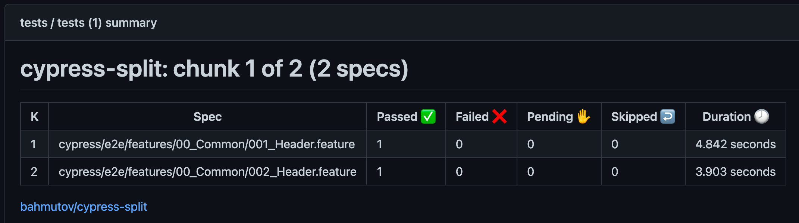

# cypress-split-cucumber-example  

> Run Cypress tests in parallel for free for Cucumber feature specs

Using the free plugin [cypress-split](https://github.com/bahmutov/cypress-split) without any external services

📝 Read the blog post [Run Cypress Specs In Parallel For Free](https://glebbahmutov.com/blog/cypress-parallel-free/).

## Small print

Author: Gleb Bahmutov &lt;gleb.bahmutov@gmail.com&gt; &copy; 2023

- [@bahmutov](https://twitter.com/bahmutov)
- [glebbahmutov.com](https://glebbahmutov.com)
- [blog](https://glebbahmutov.com/blog)
- [videos](https://www.youtube.com/glebbahmutov)
- [presentations](https://slides.com/bahmutov)
- [cypress.tips](https://cypress.tips)
- [Cypress Tips & Tricks Newsletter](https://cypresstips.substack.com/)
- [my Cypress courses](https://cypress.tips/courses)

License: MIT - do anything with the code, but don't blame me if it does not work.
